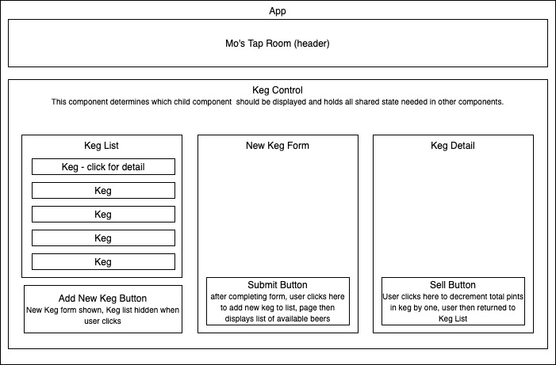

# Tap Room

#### Epicodus: React: Independent Project 1

#### by: Ryan Duff 

## Description
This is a web application intended for use in a tap room. It allows a manager or owner to keep track of the amount of beer in any given keg they might have in stock, decrementing as pints are sold and giving alerts when the keg is nearly empty and completely empty. The app is a front-end application built entirely on HTML, CSS, Javascript and React.

## Application Diagram

## Setup/Installation Requirements
This project will run on any current web browser, Google Chrome is recommended. 
* Users will need to clone the project from my GitHub repository at https://github.com/RyanDuff613/Tap-Room.git . Once cloning is complete and the project files are available on a user's local computer, the user will be required to install all dependencies via NPM's command line interface. 
* Enter project folder via command line and run $ npm install. 
* When installation is complete run $ npm run build. NPM will create a folder named dist. 
* Using Chrome, open the index.html file located in the Dist folder to view the project.

## Specifications

| Behavior       | Input         | Output  |
| :------------- |:--------:| :-----------|
|Navigate to site, see list of available beers.|localhost:3000|Homepage with list of available beers|
|Click on keg to see detail page about the beer|Click "Widmer Hef"|Detail page for Widmer Hef|
|Click a button to add a new keg|Click "Add New Keg"|Form for adding new keg|
|Click a button to decrement total number of pints left in keg when a sale is made.|Click "Pint Sold"|Total pints left in keg decreased by one unit|

## User Stories Employed to Determine Behavior Driven Development Strategy
* As a user, I want the option to edit a keg's properties after entering them just in case I make a mistake.
* As a user, I want to be able to delete a keg.
* As a user, I want a keg to update to say "Out of Stock" once it's empty.
* As a user, I want kegs with less than 10 pints to include a message that says "Almost Empty" so I can try a pint before it's gone!
* As a user, I want to have kegs prices to be color-coded for easy readability. This could be based on their price, the style of beer or kombucha, or the amount of pints left.
* As a user, I want this application to be nicely styled. (Use stylesheets and CSS objects!)

## Technologies Used
* _HTML_
* _CSS_
* _Javascript_
* _React_
* _Markdown_
* _git & gitHub_

## Known Bugs

### License

**The MIT license**

Copyright (c) 2020 **Ryan Duff**
